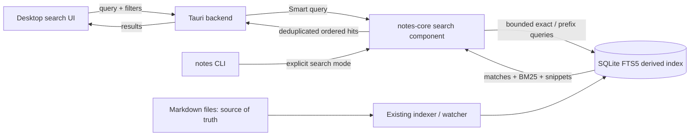

# Smart search

**Status:** first delivery implemented and verified locally (core Smart mode, CLI `--smart`, desktop default). Open follow-ups: partial-coverage recovery, typo suggestions, search highlighting, and an agreed latency budget.

## Why

Finding a note should not require remembering or finishing its exact words. Searching **`memo` must surface a note titled `Memory`**. A title usually expresses the note’s subject, so a title match should carry more weight than the same match in Markdown body text.

Foglio already uses SQLite FTS5 and weighted BM25. The desktop used to require complete words joined with AND; BM25 ranked only the notes that passed that restriction. Improve candidate matching, not replace the search engine.

## First delivery: Smart mode

Make Smart the desktop default. Preserve the existing literal, phrase, and prefix modes and CLI defaults; `notes search … --smart` exposes the new behavior explicitly.

1. Tokenize with the index’s `unicode61` tokenizer, retaining case/accent normalization and safe literal handling of punctuation and operators.
2. Retrieve **all-word exact matches** first.
3. Fill remaining result slots with **all-word prefix matches**, deduplicated by note path. Expand every token of at least two characters; shorter tokens remain exact. This threshold is a starting policy to validate with multilingual fixtures.
4. Rank within each tier using existing BM25 weights: **title 10, body 1, path 2, tags 2**. Break ties by path. Exact-match tier takes precedence over field weighting; title weighting is a relevance preference, not an unconditional title-first rule.
5. Apply the requested limit and exact tag/folder filters to every tier. Keep empty-query browsing unchanged.

| Search | Required result |
| --- | --- |
| `memo` | Finds `Memory`, including when only the title matches. |
| `MEMO` | Also finds `Memory`. |
| `proj bud` | Finds a note containing `project budget`. |
| `memo` with comparable prefix-only notes | `Memory` in the title ranks above `Memory` only in the body. |
| `memo` | A complete-word `memo` match precedes prefix-only `Memory` matches. |
| `get` | Does not match `budget` merely as an interior substring. |

**Why tiers:** predictable exact-before-expanded results. Do not merge raw BM25 scores from separate query expressions as though they shared a relevance scale.

## Architecture — C4 component view (simplified)

Keep matching and ordering in `crates/notes-core/src/search.rs`; select Smart mode in `apps/desktop/src-tauri/src/lib.rs`. No external service, embeddings, note rewrites, or initial index migration. Consider FTS prefix indexes only if measurement justifies their storage/rebuild cost.

## Follow-ups

- [ ] **Partial-coverage recovery:** only when no all-word results exist, show a labelled “Matching some words” section. Order by distinct query-token coverage, then relevance; preserve filters and bounded retrieval. Add match-kind metadata rather than making the UI infer why a note matched.
- [ ] **Typo suggestions:** when normal matching finds nothing, offer “Did you mean …?” using the indexed vocabulary. Start with one edit, including adjacent transposition, for words of at least four characters. Bound candidates/work; only suggest corrections with results inside active filters. Never silently rewrite the query.
- [ ] **Search highlighting:** highlight matched text in result titles and snippets so users can see why a note surfaced. For `memo` → `Memory`, highlight `Memo`, preserving original case. Support exact and expanded matches using backend-derived spans aligned with the search tokenizer; do not independently guess matches in the UI. Return plain text plus structured spans and render safely—never inject note content as HTML. Specify/test Unicode offset units across Rust and JavaScript. Highlighting inside the opened note is a separate scope decision.

No arbitrary substring search, stemming, synonyms, or semantic search in this feature.

## Implementation notes

- `SearchMode::Smart` and `SearchQuery::smart` live in `crates/notes-core/src/search.rs`; the single prepared statement, all BM25 weighting and the binary path tie-break stay in one place.
- Literal/phrase/prefix expressions are unchanged, so existing CLI scripts and tests keep their behavior. `--phrase`, `--prefix` and `--smart` are mutually exclusive.
- The desktop backend selects Smart for every query (`apps/desktop/src-tauri/src/lib.rs`); the frontend, its stale-response guard and the result contract are unchanged.
- No index migration, no new dependency, no FTS prefix index: prefix queries run against the existing `notes_fts` table.

## Acceptance and delivery gate

- [x] Core tests cover every example above, exact/prefix deduplication, limits, stable ties, and strict filters in both tiers: `smart_mode_matches_word_prefixes_and_ranks_titles_above_bodies` in `crates/notes-core/tests/search.rs`.
- [x] Regression tests retain explicit literal/phrase/prefix semantics, Unicode/accent behavior, and hostile-input safety: the pre-existing query test in the same file is unchanged and still passes.
- [x] Desktop backend and native acceptance prove that typing `memo` surfaces a `Memory` title and clicking opens the correct note, with controlled title-versus-body fixtures: `apps/desktop/src-tauri/tests/backend.rs` and `tests/acceptance/search_smart.py` on the real WebKit build.
- [x] Stale-response protection is untouched; the existing frontend regression still covers rapid query changes, and note edits/deletions converge through the existing index lifecycle.
- [ ] Measure end-to-end search latency on representative small/large libraries, including broad prefixes and reconciliation—not SQL alone. Agree a latency budget before release; do not hold a search session’s writer-blocking lock between keystrokes. Prefix expansion adds one bounded extra query per keystroke, so this belongs with the open P7-03 budget work.

Ship the first delivery independently. Recovery, typo suggestions, and highlighting remain explicit follow-up work, not prerequisites for `memo` → `Memory`.
