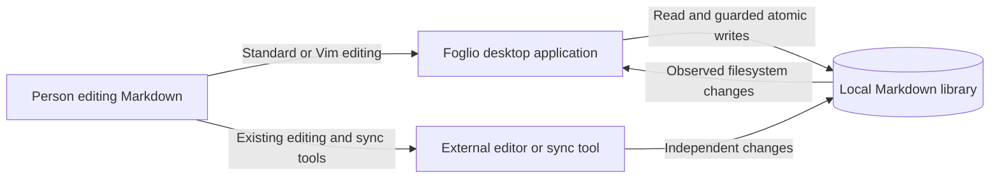
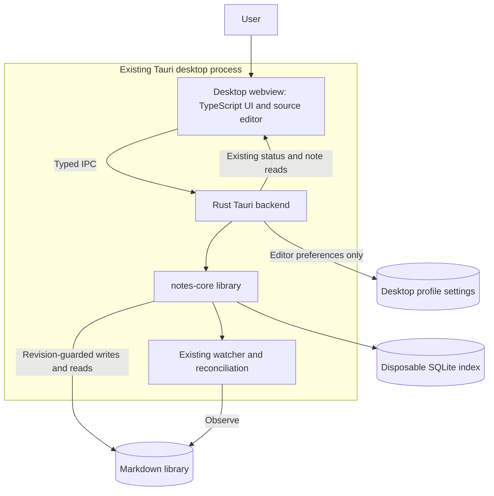
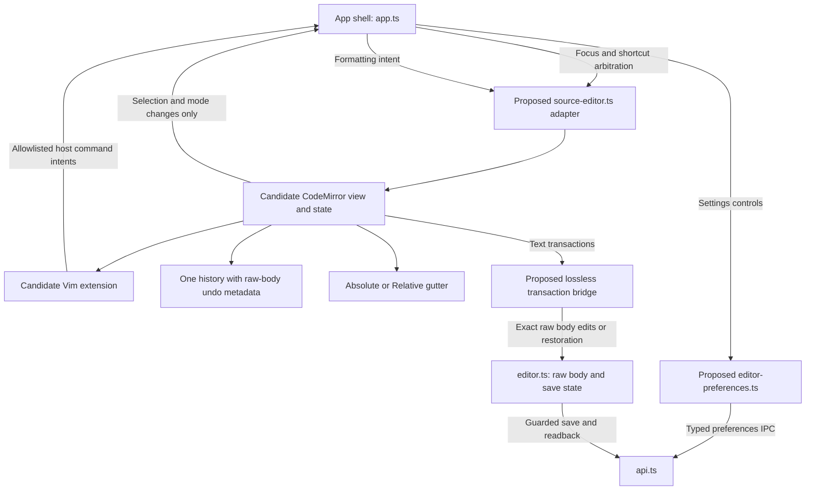
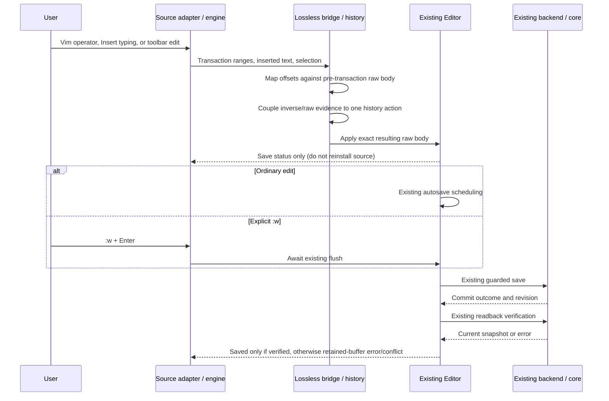

# Vim source editing — system design and implementation guidance

**Status: target architecture, not implemented.** Complements the [product contract, decisions and acceptance](vim-source-editing.md). The owner has resolved the product questions; CodeMirror adoption remains conditional on VM-01 evidence. Paths marked proposed do not yet exist. The Mermaid flowcharts below are simplified C4 views, not a claim that new services or processes are required.

## C4 level 1 — system context

Markdown files remain authoritative persisted content. Vim is an input behavior inside Foglio, not another filesystem writer. External editors remain independent; this feature cannot eliminate the existing uncooperative-writer race. No remote service or Neovim process is added.

## C4 level 2 — runtime containers and stores

The webview and Rust boundary is a logical runtime boundary; `notes-core` and its watcher are in-process library components, not network services. Editor preferences belong to desktop profile storage. They do not go into Markdown, the disposable index or shared library-selection config. Existing appearance persistence is unchanged. No new IPC for individual keystrokes: edits stay in the frontend until the existing autosave/flush path writes a body.

## C4 level 3 — frontend components

The bridge/history boxes describe responsibilities; VM-01 decides whether these warrant separate files. Do not create a framework of interfaces without a demonstrated integration need. Keep imports of dependency-specific APIs within the adapter/bridge where practical.

### Ownership and invariants

| State or action | Sole owner / boundary | Invariant |
|---|---|---|
| Canonical current unsaved body, raw newline bytes | Existing `Editor`, updated through the lossless bridge | Engine text is a normalized editing projection, never the byte-preservation authority. |
| Saved revision, dirty/saving/conflict state | Existing `Editor` and existing backend guards | Keymap and selection changes cannot mark a document saved or clear a conflict. |
| Caret, selection, scrolling, Vim mode/pending prefix | Source adapter and engine | UI status rerenders do not reconstruct editor state. |
| Undo/redo | One engine history with coupled raw restoration metadata | Do not retain `SourceHistory` as a second active stack. Autosave cannot truncate undo or lose raw newline evidence. |
| Frontmatter/BOM and disk commit policy | Existing document/backend boundary | Adapter edits the body only; no AST round-trip or metadata injection. |
| Formatting | Existing pure range helpers through adapter transactions | Toolbar, Vim and Standard edits share history and save semantics. |
| `:w` | Host intent handled through `Editor.flush()` | No direct backend save bypass and no success before existing verification. |
| Preference persistence | Rust backend; typed frontend preference state | Update visible active preference only after successful persistence; preserve unrelated fields. |
| Relative labels | Pure selection-derived gutter projection | No text mutation, history entry, save, or metadata write. |

### Proposed adapter contract — responsibilities, not invented APIs

VM-01 should define a small concrete interface covering:

- Install a newly read note snapshot with its identity; reset note-local state once, not on every render.
- Apply read-only/busy state without changing text/history.
- Reconfigure Standard/Vim and gutter options without reinstalling the document.
- Read/restore active selection and focus; execute formatting replacements as transactions.
- Report content changes separately from selection/mode changes and host command intents.
- Dispose engine listeners/extensions on application teardown. Reconfiguration must not register another global handler.

Use the existing editor session and path to guard asynchronous results; never infer note identity from matching content. Do not freeze concrete CM6 imports/hooks into the specification until the pinned dependency spike proves them.

## Dynamic view — editing, autosave and explicit write

This is an integration flow, not a replacement save state machine. Preserve current scheduling rules when an edit arrives during an in-flight write: do not mark a newer generation clean on an older acknowledgement. Conflict/missing/error transitions remain those of `Editor`.

### Raw transaction and history guidance

1. Treat engine offsets as its documented JavaScript text offsets, not bytes. Verify the pinned engine's offset units; test surrogate pairs and combining sequences. Map normalized line breaks to raw source boundaries deliberately.
2. Capture the pre-transaction raw body. For disjoint changes whose coordinates refer to the same starting document, map all ranges against that document and apply them in descending offset order (or use an equivalent proven mapping). For sequential transactions, map each against its actual predecessor. Do not confuse these models.
3. Unchanged spans retain their raw bytes. Inserted newlines follow the existing note newline preference. Undo must restore the deleted raw spans, including mixed terminators; normalized text alone is insufficient.
4. Couple raw undo evidence to the actual engine history grouping and inversion mechanism. Avoid a parallel stack indexed by guessed command counts: grouped typing, composition, dot repeat, transactions excluded from history and redo invalidate that assumption.
5. Prove the chosen metadata approach with the pinned engine. If raw restoration cannot be correctly integrated with its history, stop VM-02 and revise the recommendation rather than silently normalizing files.
6. Snapshot installation is not a user edit. Tag/route it so it neither echoes back as a save nor becomes an undoable action. Keymap reconfiguration is not snapshot installation.

## Lifecycle and event classification

| Event | Source state | Save/history effect |
|---|---|---|
| Cursor motion, Visual selection or gutter update | Update selection/mode/labels | No document save or history entry. |
| User content transaction | Apply engine transaction and exact raw change once | Existing dirty/save transitions; one coherent history action. |
| Autosave status notification | Update status UI only | Do not replace document, cursor, mode or history. |
| Toggle Standard/Vim | Reconfigure extension; cancel pending prompts/operators as specified | Preserve content, history and scroll. |
| Preview or modal entry | Cancel pending Vim input; keep mounted/retained document state as practical | Preserve committed edits and history. |
| Protected note navigation | Await existing protection; install new snapshot only on success | New note-local history; no old prefix/search operation may affect it. |
| Clean external reload | Install newly verified snapshot through existing app flow | Reset stale history and cancel pending commands. |
| Dirty external change/delete | Retain local surface and show existing conflict UI | Pause saves under existing rules; no overwrite or implicit recreation. |
| Unmount | Dispose engine/DOM/global listeners | No pending UI callback targets a destroyed surface. Existing close guard still applies. |

`:w` completion belongs to the note/session on which it started. If the app has since changed identity, do not report its result as the current note's success. Preserve the existing protection against this race, not an independent command-specific shortcut around it.

## Preference flow and relative-number projection

Settings Apply → validate typed values → persist through backend → reconfigure current surface → update controls. Disable overlapping Apply requests or serialize them so a slow earlier write cannot override a later choice. Load preferences before source key handling becomes interactive; absent configuration uses documented defaults, corrupt configuration is visibly reported and not overwritten automatically.

The follow-up has only `absolute` and `relative` styles plus independent visibility. **Relative uses the absolute current line**, as the owner requested. Selection-head updates feed the gutter directly, without passing through `Editor.edit` or `restoreBody`. Use viewport-aware labels and a stable document-derived width. A four-line fixture with its head on line 3 must render `2,1,3,1`; repeat with backward selection whose anchor is on a different line to prove the head owns the result.

## VM-01 handoff checklist

Before recommending implementation, the next agent should append real evidence to `docs/vim-editor-spike.md`:

- Pinned dependencies/licenses, engine hooks actually tested and dependency footprint delta.
- Concrete adapter interface, ownership choice for raw history, and a transaction trace demonstrating disjoint edits plus undo/redo after autosave.
- Native keyboard evidence for required representative commands, settings reconfiguration, shortcut arbitration, IME and command prompts; explicitly identify manual or unverified cases.
- Disk-byte assertions for preservation fixtures and save/conflict/readback regressions.
- Audited Ex surface, no direct host-sensitive engine commands, production CSP behavior and teardown results.
- Real standard-editor baseline versus candidate timings, documents, hardware/runtime and agreed budgets or remaining blockers.
- Go/no-go decision. A failed invariant is a blocked gate, not permission to narrow the approved compatibility contract silently.

Use the acceptance IDs and phased tasks in the main specification as the completion authority. The diagrams explain boundaries; they do not replace tests or authorize feature implementation in this documentation branch.
